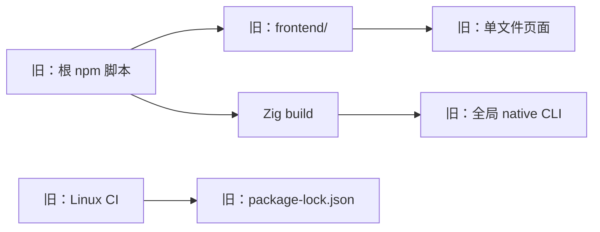
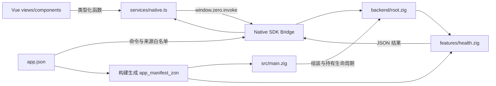
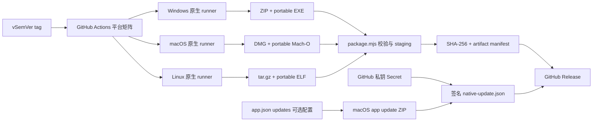

# 架构说明

## 项目定位

Native Demo 是一个中小型桌面应用模板，而不是通用应用框架。它提供 Vue WebView、Zig 本地后端、类型化 Bridge、安全白名单、测试、三平台打包和发布所需的最小完整链路。业务项目复制后，应在这些稳定边界内扩展，不继续增加无实际消费者的抽象层。

当前范围包括桌面窗口、前端热更新、生产资源装载、同步 Bridge 示例、组件测试、后端测试、三平台 GitHub Release，以及默认关闭的 macOS 更新接入点。数据库、后台服务、Windows/Linux 自动更新、额外安装器、安装器签名和商店发布在业务明确需要前不预装。

## 迁移结果

迁移前的主要问题是前端名称不够醒目、npm 与 pnpm 混用、Native SDK 路径绑定个人 Homebrew、版本散落，以及只有单平台 CI。下面仅保留历史对照，当前项目不得继续使用这些旧路径和工具：



标准化后，根 pnpm workspace 是唯一命令入口，`src_web` 与 `src` 清晰表达前后端归属，Native SDK 作为锁定依赖参与所有构建：

```mermaid
flowchart LR
    Workspace[pnpm workspace] --> Web[src_web/ Vue]
    Workspace --> SDK[node_modules/@native-sdk/cli]
    Build[build.zig] --> SDK
    Build --> Zig[src/ Zig backend]
    Build --> WebDist[src_web/dist]
    SDK --> SdkLoader[WebView2 x64 / arm64 loader]
    AssetLoader[assets x64 loader 基准] --> LoaderCheck[package.mjs loader 校验]
    SdkLoader --> LoaderCheck
    Manifest[app.json 唯一应用版本源] --> Sync[version.mjs]
    Manifest -->|应用配置| Build
    Sync --> Packages[package.json + build.zig.zon]
    NativeConfig[config/native.json] --> DevSync[dev-config.mjs]
    DevSync --> Manifest
    NativeConfig --> Vite[Vite server]
    NativeConfig --> Build[build.zig build_options]
    Build --> Zig[src/ Zig backend]
    CI[CI / Release] --> Workspace
    CI --> Build
```

## 运行时组件



`src/main.zig` 是 composition root。它决定生产或开发资源源，创建长生命周期服务，并把 Bridge dispatcher 交给 runner。它不应出现具体业务分支。

`src/backend/root.zig` 同时拥有 handler registry 和运行时策略。`app.json` 的声明用于 CLI 验证和打包，Zig 策略用于真实运行时授权；后端测试逐项核对命令、handler 和来源，`native doctor` 负责 manifest 自身合法性。测试入口显式引用 feature，避免 Zig 按需分析使测试被跳过。

`src_web/src/services/native.ts` 是前端唯一原生边界。页面与组件不知道 Bridge 的全局对象形状，因此可以在浏览器预览和 Vitest 中替换适配层。

## 数据流

以 `app.health` 为例：

1. `DashboardView` 调用 `getBackendHealth()`。
2. 适配层确认 Bridge 存在并调用 `window.zero.invoke`。
3. Native SDK 检查调用来源和 command policy。
4. `Backend` 从 registry 找到 `health.Service.handle`。
5. handler 更新后端请求计数并返回 JSON。
6. 适配层以 `BackendHealth` 类型交给页面，页面展示连接状态和后端版本。

新增命令必须沿同一条链路补齐 manifest、运行时策略、handler、适配函数和测试。任何一层绕行都会削弱安全性或可测试性。

## 构建与资源流

开发模式下，`native dev` 按 `app.json` 启动 `src_web` 的 Vite 服务。地址由 `config/native.json` 唯一决定，再同步到 manifest，并通过 `build_options` 注入 Zig Bridge policy。`strictPort` 固定为 `true`：端口占用时立即失败，防止 Vite 自动递增后形成页面地址与安全白名单不一致的半可用状态。

标准生产模式先由 Vite 输出相对路径资源到 `src_web/dist`，Native SDK 再将该目录复制到平台包的资源位置。macOS 包中资源位于 `Contents/Resources/src_web/dist`；Windows 和 Linux 位于 `resources/src_web/dist`。

portable 构建复用同一份 `src_web/dist`，由 `scripts/embed-assets.mjs` 将前端资源和可选的原生运行库编入 bundle。程序首次启动时将页面写入按版本和内容哈希区分的用户缓存，再以 `zero://app` 资源源加载；下载产物仍是单文件，运行时缓存不是用户需要携带的发布目录。

Windows 的系统 WebView host 动态加载 `WebView2Loader.dll`。标准包由 Native SDK 复制目标架构 DLL；portable bundle 携带同一 DLL，启动时释放到随机、内容带指纹的缓存目录并预加载。正式运行路径使用 Native SDK 提供的目标架构 loader。仓库同时保留 `assets/WebView2Loader.dll` 作为 x64 基准和恢复文件，质量检查验证它与 SDK 双架构 loader 的 PE 头，标准包校验再比较最终 DLL 与 exe 架构。

## 发布与更新流



`zig-out/package/` 保存平台打包过程的目录和原始输出，`zig-out/release/<target>/` 只保存公开分发文件。workflow 与本地脚本都调用同一个 `package.mjs` 校验和 staging 规则，因此不会各自维护一套文件名 glob。

自动更新必须绑定到某个真实发布源，因此具体应用启用时会把 GitHub `owner/repository` 和 Ed25519 公钥写入 `app.json`。模板本身不含 `updates` 字段，不绑定示例仓库。Native SDK 0.10.1 只会从打包后的 macOS `.app` 执行更新；portable 构建在 runner 层清空更新配置，Windows/Linux 也不宣称拥有尚不存在的安装生命周期。

## 测试边界

单元测试和 Vue 组件测试与实现就近放置，便于按模块移动、删除和审查。`src_web/src/test/` 仅容纳共享测试环境；未来跨页面 E2E 放到 `src_web/tests/e2e/`。后端测试继续放在对应 Zig 模块内，利用 Zig 原生 `test` block。只有跨多个模块的黑盒流程才建立顶层测试目录。

## 工程脚本

`.sh` 和 `.ps1` 是 macOS/Linux 与 Windows 的用户入口。MJS 不是平台启动脚本，而是 Node 提供的跨平台结构化任务：`dev-config.mjs` 管端口派生配置，`package.mjs` 管产物，`rename.mjs` 管模板改名，`version.mjs` 管版本。清理和校验已合并到 `package.mjs`，其余三项生命周期不同，继续合并只会形成一个难维护的万能脚本。

## 关键取舍

- 使用 hash router：URL 不如 history 模式简洁，但对离线 scheme 和单入口资源最稳定。
- Native SDK 固定为 npm 开发依赖：仓库体积更小，pnpm lock 可复现；升级 SDK 时仍需审查生成的 `build.zig` 和 `runner.zig` 差异。
- `build.zig` 和 `runner.zig` 较大：它们承载平台集成，强行按业务风格拆分会增加升级成本，所以业务边界集中在 `backend/`。
- 当前 dashboard 保留页面级 CSS：这是为了不改变已有视觉基线；新功能可以使用 Tailwind，但不需要机械改写稳定样式。
- 三平台使用原生 runner：构建速度不如单机交叉编译，但能真实链接各平台 WebView，并产出可验证的原生归档。
- portable 是单个分发文件，不等于全静态程序：macOS/Linux 仍用系统 WebView，Windows 仍需要已安装的 WebView2 Runtime。
- Windows 默认保留标准目录包并发布 portable EXE，不依赖额外 ZIP 工具；Linux tar.gz 是标准分发归档。这些产物都不是安装向导。Native SDK 0.10.1 尚不生成 MSI、安装型 EXE、deb/rpm、AppImage 或 Flatpak，具体项目需要时再选择并维护外部打包器。
- GitHub Release 更新采用显式 opt-in：少一个开箱即用开关，但避免模板误连原仓库，也避免未签名更新链路。

## 一致性约束

- `app.json.version` 是唯一版本源，两个 workspace 和 Zig zon 的版本字段由 `pnpm version:sync` 派生。
- `config/native.json` 是开发 host/port 唯一来源，其他地址由 `pnpm dev:config:sync` 派生。
- `app.json` 中只有开发地址由 `config/native.json` 派生；版本、窗口、Bridge 命令、capability、安全权限、Web 引擎与 CEF 设置都在 manifest 维护。
- tag 必须为 `vMAJOR.MINOR.PATCH` 且与版本文件相同。
- Bridge 命令在 `app.json`、Zig registry 和 TypeScript adapter 中同名。
- `base: "./"`、hash router 与 `src_web/dist` 路径共同构成离线资源约束，不单独修改其中一项。
- 日常入口统一为 pnpm；`native` 统一通过 `pnpm exec native` 使用锁定版本。

## 扩展顺序

1. 从模板改名并运行全套检查。
2. 在 `src_web/src/features` 与 `src/backend/features` 建立第一个真实业务能力。
3. 为 Bridge 输入、错误和权限拒绝补测试。
4. 只有数据确实需要持久化时再启用数据库 capability。
5. 发布前配置平台签名、更新策略和真实安装测试。
